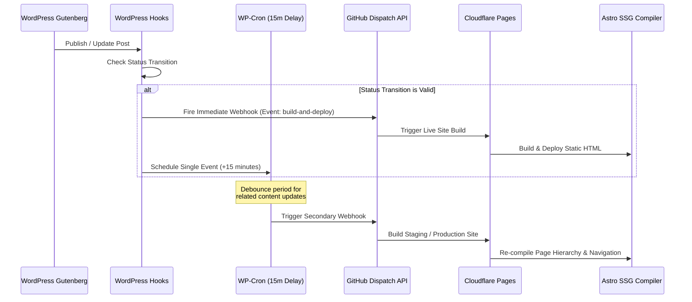

# Architectural Comparison: Pure Astro Static Routing vs. Hybrid Headless WordPress

This report analyzes the trade-offs of deploying a pure Astro page setup versus the current hybrid headless WordPress architecture. The analysis is structured around compile times, edit control, and developer velocity.

---

## 1. Pure Astro Static Routing Architecture

Astro is designed around a static-first methodology (`output: 'static'`), where the entire routing table and component hierarchy are evaluated and compiled into flat HTML pages during the build phase.

### Directory-Based Routing and Dynamic Paths
Astro utilizes a directory-based routing model mapped directly to standard filesystem structures within the `src/pages/` directory:
* Standard pages resolve to direct layout outputs (e.g., `src/pages/services.astro` compiles to `dist/services/index.html`).
* Dynamic paths are defined using bracketed filenames (e.g., `[slug].astro` or the catch-all `[...slug].astro`).

For dynamic route generation, Astro requires the dynamic page component to export a `getStaticPaths()` API:

```typescript
export async function getStaticPaths() {
  const pages = await getPages();
  return pages.map((page) => ({
    params: { slug: page.slug },
    props: { page }
  }));
}
```

During the build process, Astro runs this function in an isolated Node.js context. The compiler maps the returned array of parameters and properties directly to individual static routes, rendering HTML pages that require zero client-side routing logic.

### The Vite-Based Build Pipeline
Astro divides build-time compilation duties between a Go-based compiler and the Vite asset pipeline:
* **Go-Based Compiler**: Parses `.astro` files to separate component frontmatter (TypeScript/JavaScript between the `---` code fences) from the HTML template. It constructs an Abstract Syntax Tree (AST) to trace component imports, assets, and styling dependencies.
* **Vite Engine**: Resolves file imports, processes CSS preprocessors (Sass), tracks the asset dependency graph, and manages Hot Module Replacement (HMR) during local development.
* **esbuild Integration**: TypeScript and JavaScript compilation is handled by `esbuild`. Being compiled in Go, it transpiles source files rapidly.
* **Rollup Production Bundler**: Production builds are packaged by Rollup. It performs tree-shaking, removes unused dependencies, and outputs minified, code-split assets with unique content hashes (e.g., `style.Cr9X8_2a.css`) to optimize CDN caching.

### Type-Safe Content Collections
Content Collections are a local-first content database built directly into Astro (stored in `src/content/`). They enforce schema validation at build time using the Zod validation library:

```typescript
import { defineCollection, z } from 'astro:content';

const servicesCollection = defineCollection({
  type: 'content',
  schema: z.object({
    title: z.string(),
    description: z.string().max(160),
    category: z.enum(['hvac', 'lighting', 'water', 'controls']),
    draft: z.boolean().optional().default(false)
  })
});
```

#### Key Content Collection Capabilities:
1. **Schema Validation**: Frontmatter data is validated against the defined Zod schemas. If an editor omits a required field or enters an incorrect type, the compiler halts immediately, highlighting the file path and line number.
2. **Automated Type Generation**: On dev server startup or during build runs, Astro parses Zod schemas and generates TypeScript definitions (`.d.ts` declaration files) inside the local `.astro/` directory. This enables autocompletion and typechecking in the developer's editor.
3. **Optimized Data Fetching**: Unlike generic file parsing utilities, `getCollection()` caches parsed data in memory, avoiding redundant disk reads and glob operations.

### Styling Architecture
* **Scoped Component Styling**: Astro automatically scopes CSS declared within component `<style>` blocks. The Go compiler hashes the selectors and appends a unique scoping attribute (e.g., `data-astro-cid-xxxxxx`) to the output elements, isolating styles to the component.
* **Responsive Styling Conventions**: Styling is structured with a mobile-first philosophy. Base files (e.g., `mobile.scss`) apply to all viewports, and overrides for larger displays are nested in `desktop.scss` using a `min-width` responsive mixin. This prevents specificity issues associated with mixed `min-width` and `max-width` queries.
* **LCP Optimization**: Small scoped stylesheets are automatically injected inline in the document `<head>` during compilation. This prevents flash of unstyled content (FOUC), improves Largest Contentful Paint (LCP) performance, and eliminates extra render-blocking network requests.

---

## 2. Hybrid Headless WordPress Architecture

The hybrid headless architecture combines a WordPress CMS backend with a static Astro frontend. Content editors manage data via Gutenberg blocks, and Astro fetches this content during the static build via the WordPress REST API.

### Visual Block Editor Customizations
To ensure layout control for non-technical editors, the system registers custom Gutenberg blocks using React:
* **Visual Parity**: Blocks are visual representations of frontend components (e.g., the Skewed Two-Column layout block `e3es/two-column`).
* **Nested Templates**: Gutenberg's native `InnerBlocks` preload structured layouts (including section icons, headings, and descriptions).
* **Sidebar Metadata Panels**: Document-wide metadata is managed via custom React sidebars (`E3PageSettingsPanel`). It conditionally displays fields for custom post types (e.g., card excerpts for Services; logos, locations, and scope details for Clients).
* **Editor State Stability**: Setting updates are dispatched directly to the Gutenberg Redux store:
  ```javascript
  wp.data.dispatch('core/editor').editPost({ meta: { [field]: value } });
  ```
  This updates the single source of truth inside `@wordpress/data` to ensure undo/redo history tracking and stable database writes.

### Webhook Rebuild and Deployment Workflow
Because pages are statically pre-rendered, changes made in WordPress must trigger a rebuild of the Astro application:



#### Rebuild Workflow Mechanics:
1. **Transition Filtering**: The helper plugin registers a hook on `transition_post_status` in WordPress, triggering only when public post types transition to or from a `publish` state.
2. **Immediate Deployment**: The plugin sends a POST request to the GitHub Repository Dispatch API (or Cloudflare Pages Deploy Hooks) to trigger an immediate environment rebuild.
3. **Cron Consistency Sweeps**: To handle cross-referenced data structures (like global navigation menus and parent-child breadcrumbs), the plugin schedules a delayed rebuild via WP-Cron (`cf_deploy_delayed_build_event`) 15 minutes after the initial edit. This debounces rapid saves and executes a clean rebuild to align global paths.

---

## 3. Structural Comparison Matrix

The table below contrasts the technical characteristics of a pure Astro static routing setup with the hybrid headless WordPress + Astro integration.

| Dimension | Pure Astro Static Setup | Hybrid Headless WordPress + Astro |
| :--- | :--- | :--- |
| **Content Source of Truth** | Local flat files (Markdown, JSON, MDX) on disk. | Relational database (MySQL) accessed via WP REST API. |
| **Data Integrity Verification** | Strict compile-time validation via Zod schemas. | Loosely typed JSON; requires runtime type guards. |
| **Build Dependency** | Disk-bound; fully offline compile support. | Network-bound; requires active WP API availability. |
| **Hot Module Replacement** | Instant Vite HMR (typically sub-50ms). | Local SASS compilation synced to WP via custom script. |
| **Routing Model** | Flat, predictable file-based mappings. | Dynamic hierarchical permalinks requiring regex rewrites. |
| **Database Queries at Runtime** | Zero. | Zero on frontend; API fetches during build. |
| **Styling Model** | Automated component-scoped CSS. | SASS compilation synced to WP plugins (`sync-styles.js`). |
| **Infrastructure Overhead** | Zero server setup; CDN host only (Cloudflare). | Web server, database, WP-CLI, webhooks, and cron. |
| **Developer Complexity** | Low; unified TypeScript codebase. | High; coordination across PHP, React, SASS, and Astro. |

---

## 4. Key Architectural Trade-Offs

Comparing a pure Astro setup with the hybrid architecture highlights distinct trade-offs in build compilation, edit control, and developer velocity.

### Compile Times and Build Performance
* **Pure Astro Static Setup**: Local file reads from disk are extremely fast. A pure static build compiles in seconds. Because the content database is local, Vite's asset graph resolves instantly, and incremental builds reuse local compilation caches.
* **Hybrid Headless WordPress**: Astro must execute paginated REST API fetches over HTTP during compilation. The build start is bound by network latency and API response times. Large content libraries (e.g., hundreds of pages and services) introduce network overhead, rate-limiting risks, and possible compilation timeouts on CI/CD runners. Additionally, Astro must download and process external images during compilation, adding minutes to fresh production builds.

### Edit Control and Preview Systems
* **Pure Astro Static Setup**: Version control is integrated directly with the content. Developers retain precise control over layout structural details, and content modifications undergo branch reviews, linting, and staging tests before merging. However, editing introduces friction for non-technical users, who must edit raw Markdown/YAML files or use Git-backed CMS interfaces (like Decap CMS or TinaCMS) that lack instantaneous layout preview controls.
* **Hybrid Headless WordPress**: Non-technical content editors have full visual control. The Gutenberg editor provides a drag-and-drop page assembly environment, structured sidebars, and instant media previews. The trade-off is the complexity of maintaining preview parity. To keep Gutenberg aligned with Astro components, developers must maintain duplicate markup schemas in PHP and React and compile stylesheets using custom scripts (`sync-styles.js`).

### Developer Velocity and Tooling Complexity
* **Pure Astro Static Setup**: Velocity is high. All styles, layouts, data schemas, and routing are contained in one repository. Adding a data field is as simple as updating a Zod schema and referencing it in the component template. Developers run a single `npm run dev` command and benefit from sub-50ms HMR updates without maintaining local database or web server runtimes.
* **Hybrid Headless WordPress**: Velocity is constrained by integration complexity. Style modifications require compiling SASS and syncing it to a WordPress plugin directory. Adding a database schema property requires updating the Gutenberg React block, registering the PHP metadata REST endpoints, and updating Astro's typescript definitions. If the React block layout differs by a single HTML tag or attribute casing from the backend PHP seeder templates, WordPress triggers block validation failures, prompting a "Block Recovery" crash.

---

## 5. Decoupled Edge Network Benefits

Regardless of the backend setup, maintaining a decoupled static frontend on a CDN (like Cloudflare Pages) delivers substantial operational and security benefits:

1. **Hardened Security**: The public web server is decoupled from the administration panel. The WordPress database and CMS dashboard can be restricted behind a private network or VPN. This eliminates vulnerabilities such as SQL injection, dynamic script execution, and brute-force attacks on the login interface.
2. **High-Performance Edge Delivery**: HTML files are served from edge servers closest to the user. This removes server-side rendering latency, delivering fast Time to First Byte (TTFB) and high Core Web Vitals scores without caching middleware.
3. **Auto-Scaling Infrastructure**: Because the output is flat static files, scaling is handled natively by the CDN. The frontend can handle major traffic spikes without requiring expensive database replicas or auto-scaling application servers.
4. **Resiliency and Uptime**: If the WordPress backend server encounters memory exhaustion, database issues, or network outages, the public website remains operational. The CDN continues to serve the pre-compiled static assets independently of CMS status.

---

## 6. Recommendations

The choice of architecture depends on content management requirements and team structure:
* **Select Hybrid Headless WordPress** if E3 requires daily content updates, landing page creation, and editorial management by non-technical marketing and sales personnel. The visual Gutenberg interface is necessary in these scenarios, and the engineering overhead of visual stylesheet syncing (`sync-styles.js`) and REST API normalization is justified.
* **Transition to Pure Astro Static Routes** if the site is updated infrequently or by technical personnel. Storing content locally via Markdown and Content Collections simplifies the codebase, speeds up builds, improves type safety via Zod, and eliminates database, webhook, and server hosting costs.
